# PROJECT FOR SPORTING KIDS - 
https://www.sportingkids.co.uk/

## DURATION - 
3 weeks + 

## MERN STACK - 

Although majority of the website is static. They also wanted a dynamic events page they can add contents to when they have them one, so I picked this as the best Tech to use as its not too heavy and I do enjoy coding in React.

## AIM - 

The clients, Sporting Kids wanted an improvement on their website at a reasonable price so they approached me as the Directors are close friends. 

### Previous website 

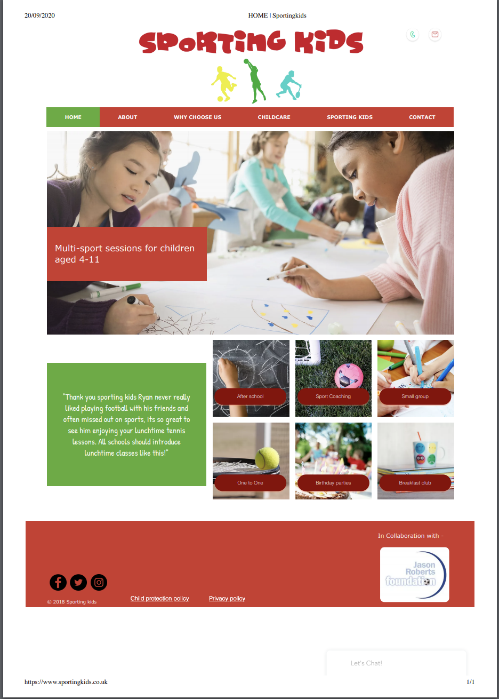

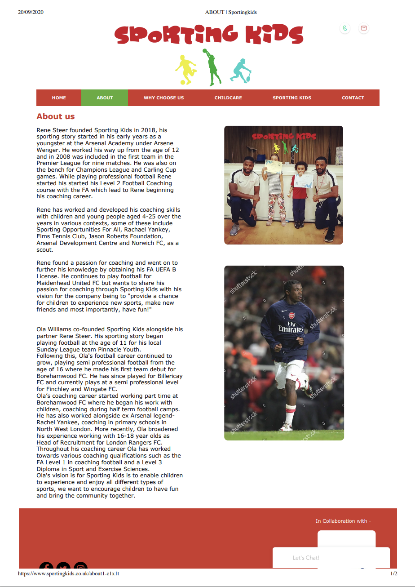

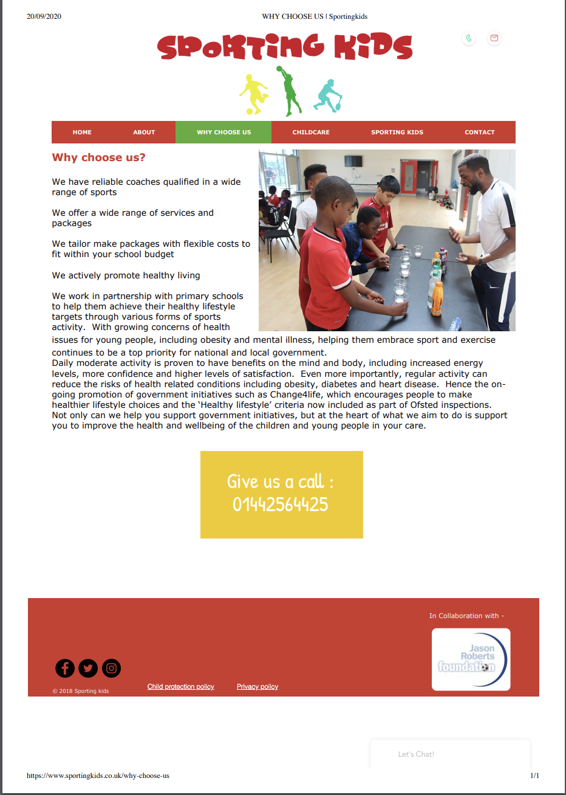

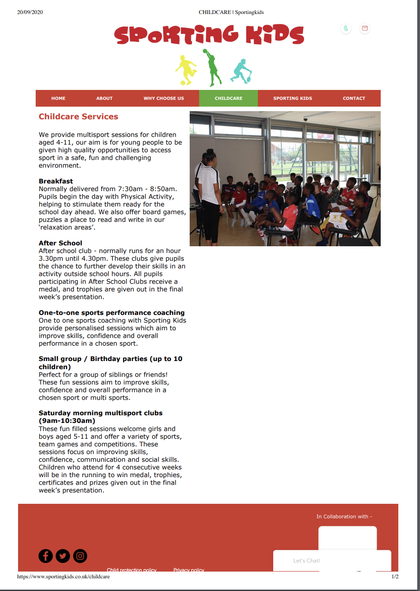

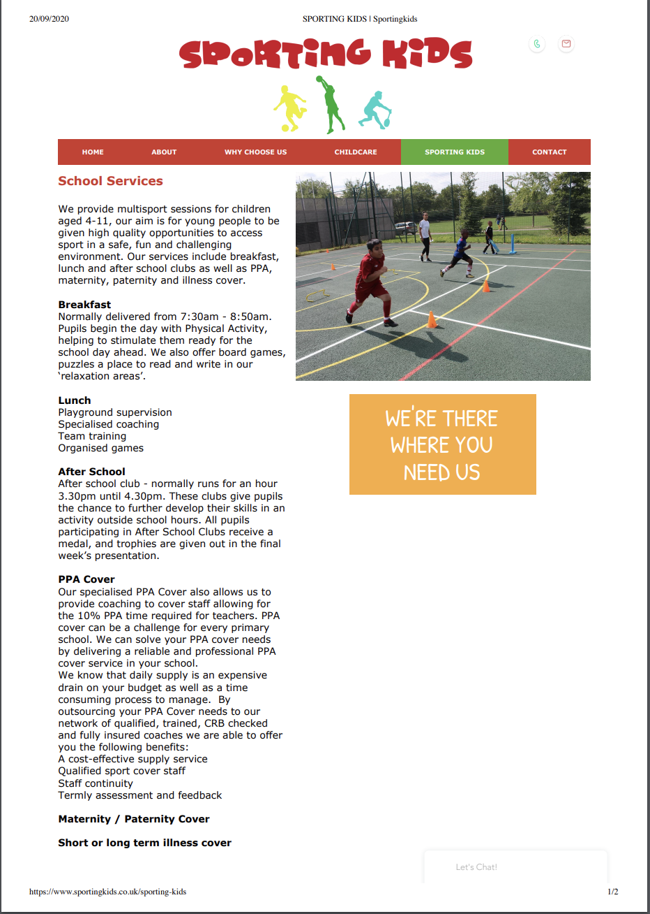

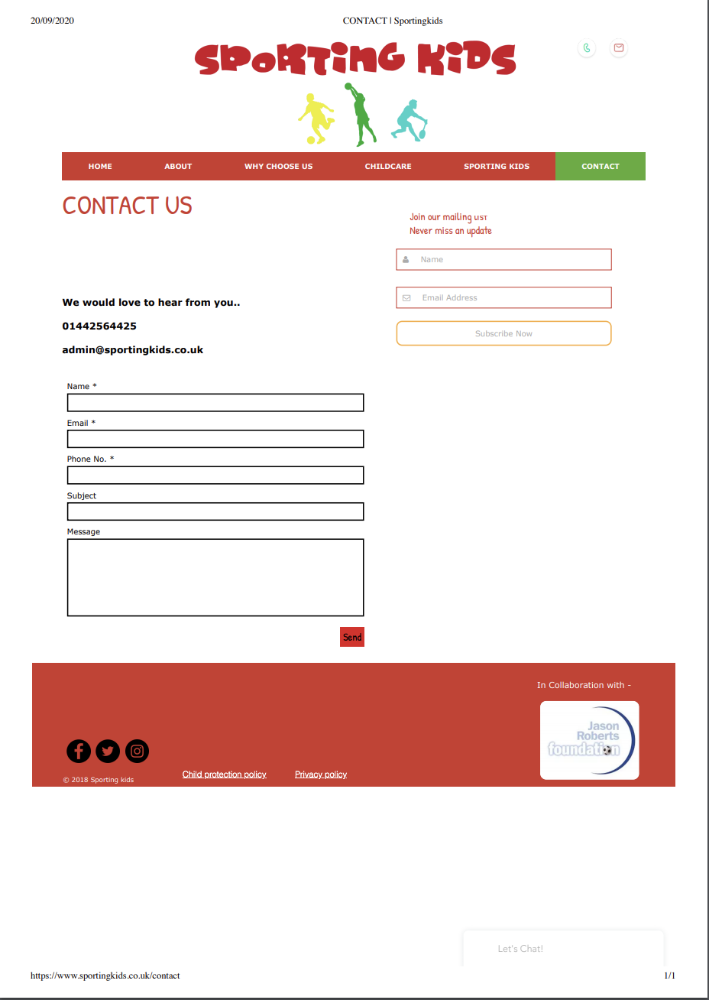

## Client Requirements

* Properly structured pages to hold details relating to a particular service
* More pictures on the website
* Clearer and more visible social media links
* Video on the landing page
* An events page that they can update dynamically 
* About us page with Bio of each coach
* Subscription form for their mailing list

## Research and design phase - 

I had a sit down with the client to better understand who their clients are, mostly Schools and Parents. This automatically gets me thinking that a  responsive website is key, especially for parents who are constantly on the move and will probably be accessing the site via their phones. 

### Design - 

I came up with a design on a wireframe (please see below) which the client was very happy with. I took aspects of their previous website and tried to improve on it where it could, such as the 6 divs on the home page which just served as routers to either the "Childcare" or "Sporting kids" page that the client could have just clicked on in the navbar. My plan was to turn them into modals that held information about that particular service. 

### Future Benga here - 
Both of the above led me to complete a one day bootcamp on UX Design with General Assembly which I enjoyed.

* Wireframe - 
HOMEPAGE
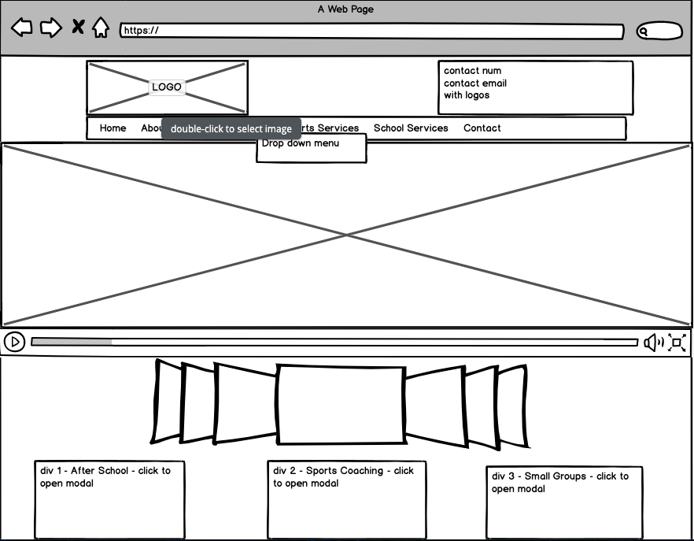

ABOUT US
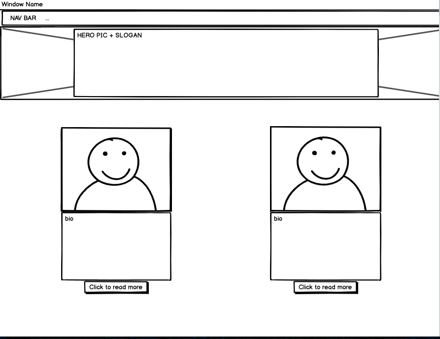

MULTISPORTS / SCHOOL SERVICES
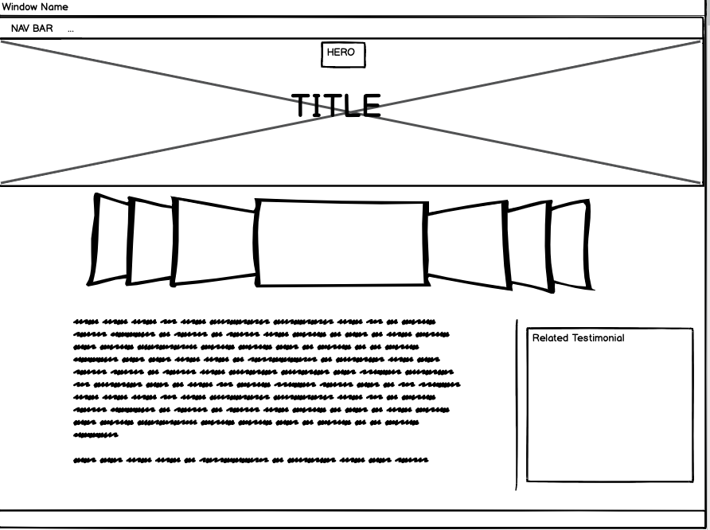

WHATS ON!
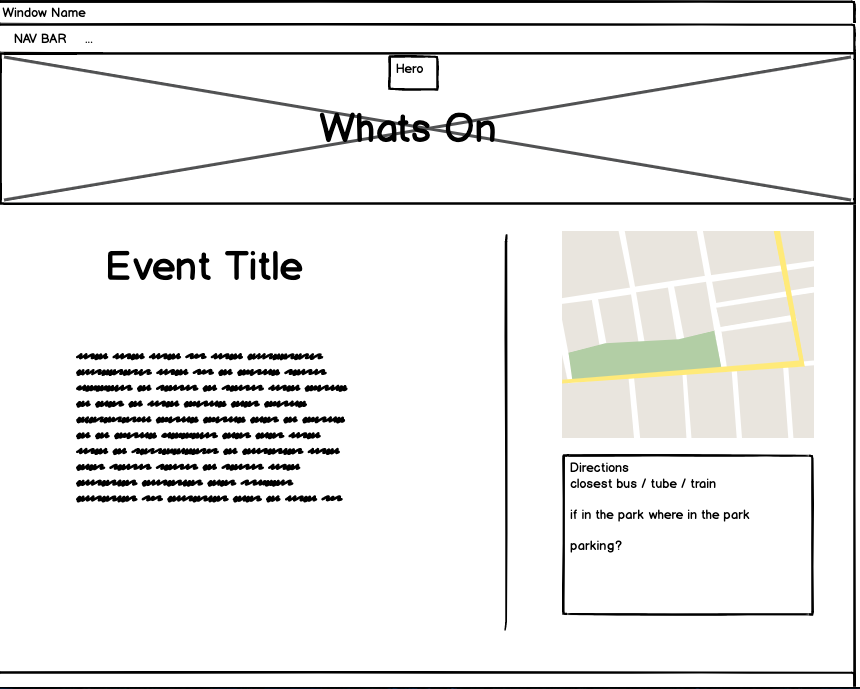

CONTACT US
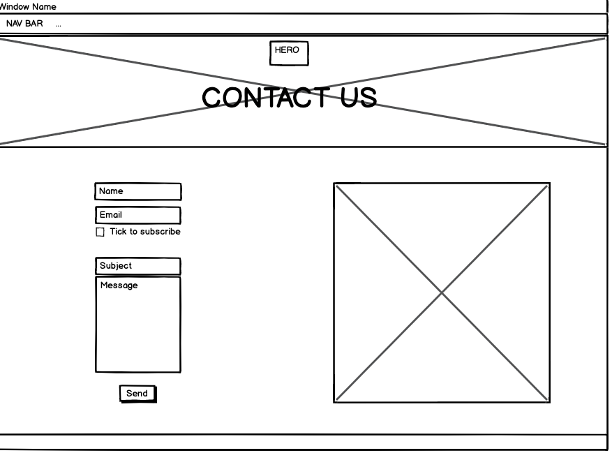

## PROJECT START - 
I started off the project by employing a colleague from my course at GA to help speed up my process as the client wanted to work on a 2 weeks timeframe initially. 

### Backend - MongoDB, Express Node and Atlas (To store the data)

We started off the with the backend over the first two days.

* Creating a user to serve as admin when creating the creating or updating an event. Including a function to login that user

### USER MODEL AND LOGIN FUNCTION
```
const userSchema = new mongoose.Schema({
  username: { type: String, required: true, unique: true, maxlength: 50 },
  email: { type: String, required: true, unique: true },
  password: { type: String, required: true }
})

userSchema
  .set('toJSON', {
    virtuals: true,
    transform(doc, json) {
      delete json.password
      return json
    }
  })

userSchema.methods.validatePassword = function(password) {
  return bcrypt.compareSync(password, this.password)
}

userSchema
  .virtual('passwordConfirmation')
  .set(function(passwordConfirmation) {
    this._passwordConfirmation = passwordConfirmation
  })

userSchema
  .pre('validate', function(next) {
    if (this.isModified('password') && this._passwordConfirmation !== this.password) {
      this.invalidate('passwordConfirmation', 'does not match')
    }
    next()
  })

userSchema
  .pre('save', function(next){
    if (this.isModified('password')) {
      this.password = bcrypt.hashSync(this.password, bcrypt.genSaltSync(8))
    }
    next()
  })

userSchema.plugin(require('mongoose-unique-validator'))
```

```
async function login (req, res) {
  try {
    // * find a user by their email
    const user = await User.findOne({ email: req.body.email })
    // * if they dont exist or password doesnt match throw an error
    if (!user || !user.validatePassword(req.body.password)) {
      throw new Error()
    }
    //* if above passes, make the user a token
    const token = jwt.sign({ sub: user._id }, secret, { expiresIn: '7 days' })
    // * send the user a token in response
    res.status(202).json({
      message: `Sup ${user.username}`, 
      token
    })
  } catch (err){
    res.status(401).json({ message: 'unauthorized' })
  }
}
```


* Creating the event model and functions to add, update and delete an event.

### EVENT MODEL AND EVENT CREATING FUNCTION
```
const eventSchema = new mongoose.Schema({
  title: { type: String, required: true, trim: true },
  description: { type: String, trim: true },
  date: { type: Date, required: true },
  time: { type: String },
  longitude: { type: String },
  latitude: { type: String },
  image: { type: String, required: true }
}, {
  timestamps: true
})

// * Function to create an event!!!!
async function eventCreate(req, res, next) {
  try {
    // Upload the file to cloudinary!
    const uploadResponse = await cloudinary.uploader.upload(req.body.image, {
      upload_preset: 'sporting-kids'
    })

    // Create instance of new event object
    const newEvent = {
      title: req.body.title,
      description: req.body.description,
      date: req.body.date,
      time: req.body.time,
      image: uploadResponse.url,
      latitude: req.body.latitude,
      longitude: req.body.longitude
    }

    // Create the event
    const event = await Event.create(newEvent)
    await event.save()
    res.json(event)

    console.log(req.body.data)
  } catch (err) {
    next(err)
  }
}

```
The function takes in the Base64 format image from the request body, sends it the cloduinary and then response url from cloudinary is stored on the image, which serves as the source for the image on the frontend.

* Image upload using Multer, which I later updated to use cloudinary due to unforeseen circumstances.
* I initially built a model and functions to collate subscribers emails. Only to find out that Sendgrid provide a service that does this automatically, after doing further research, which is what now serves the "Join our newsletter" form on the contact us page
* I tested all of the above to ensure it was fully functional using postman before moving on to the frontend.

### Frontend - React, SASS & Bulma
This is where most of the resources and time went. 

We made a quick start to the frontend with the help of the wireframe quicky building a layout of the homepage, about page and contact page using Lorem Ipsum and dummy pictures. 

This was meant to take a week or two to complete. However, the client wasnt able to deliver their contents in time as they had a busy schedule during school holidays so there was 6 weeks stop. My colleague also decided to move on to work on other things, leaving me with some halfway written codes and a number of uncompleted tasks, such as the image upload on the create event form and a static map which didnt move much. 

I ended up completing the project on my own including the styling and making it responsive. 

### HOMEPAGE - 
* Video Player - This was initially built using the react-player package. However, as time went on, I wasnt very happy with the CSS and controls that came with the package so I built my own using the HTML <video> tag. 
* Image Slideshows - Built with react slick. The package game me a lot of control over the styling of the images and containers which I quite liked.
* Divs containing their services and modals were built using Bulma and the animations with animate css.

### ABOUT - 
* Coaches card - Built using Bulma and animate css for the modal entrance.

### MULTISPORTS/SCHOOL SERVICES - 
* Testimonials - Built using Bulma message card
* Image Slideshows - Built with react slick

### WHATS ON! - 
* Dynamic page that serves the clients event when they have one on. 
* Map - Built using React Map GL and Mapbox
```
class Map extends React.Component {
  state = {
    viewport: {
      longitude: this.props.longitude,
      latitude: this.props.latitude,
      height: '280px',
      width: '320px',
      zoom: 13
    }
  }
  render() {
    const {viewport} = this.state
    return (
          <MapGl
      mapboxApiAccessToken={process.env.REACT_APP_MAPBOX_ACCESS_TOKEN}
      {...viewport}
      mapStyle='mapbox://styles/mapbox/streets-v11'
      onViewportChange={(viewport) => {this.setState({viewport})}}
    >
      <Marker
        latitude={viewport.latitude}
        longitude={viewport.longitude}
      >
        <span role="img" aria-label="marker" style={{ fontSize: '33px' }}>📍</span>
      </Marker>
    </MapGl>
    )
  }
}
```
EXAMPLE - * Excuse the screenshots please

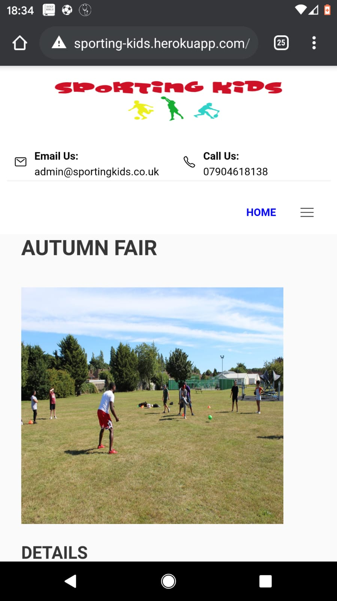

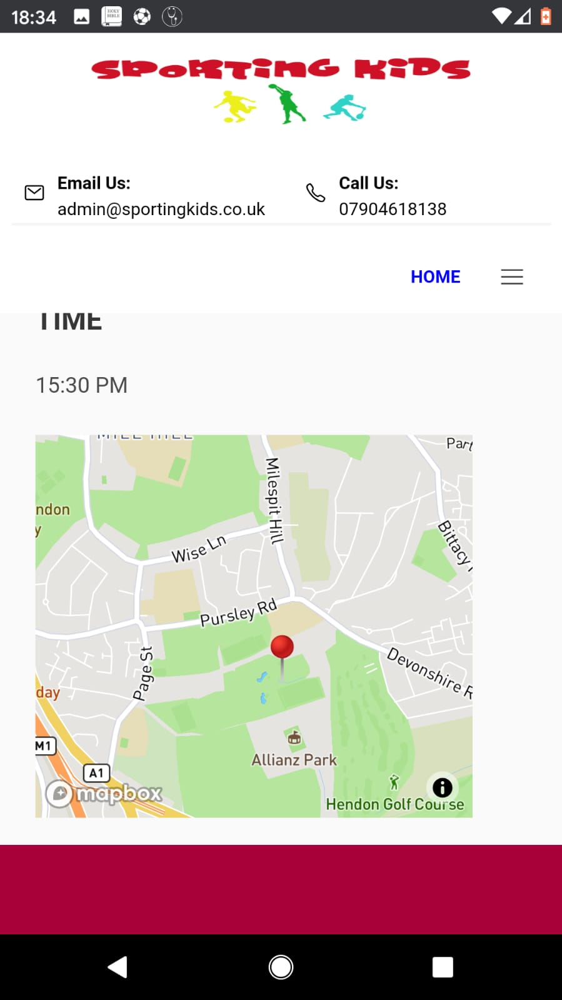

### CONTACT - 
* Contact form - Built using Bulma and the action uses "https://formspree.io/" to deliver the message to the clients inbox. I chose this to help the client save on costs which is a key factor for them
* Subscription form - Designed and served directly from Sendgrid, which collates the Subscribers email and info then stores it on the clients contact list. Making it easy to send out their Newsletters or marketing contents to their subscribers.

## POST COMPLETION - 
I deployed the site to heroku then shared it with the client, friends and family to get feedback. The feedback was very positive and helpful.

Including - 
* The page wasnt scrolling to the top when they nagivated to a different page.I was able to solve this with the following code - 
```
import {useEffect} from 'react'
import {useLocation} from 'react-router-dom'

export default function ScrollToTop() {
  const {pathname} = useLocation()

  useEffect(() => {
    window.scrollTo(0, 0)
  }, [pathname])

  return null
}
```
* The email and phone number on the navbar especially in mobile should open the users default email or telephone client with those details prepopulated. 

* The feedback also included wanting more details about the services that the client provides, which I fedback to them and they agreed with. They worked a bit more on this and also agreed to keep working on this in the future.

* Grammatical errors which I also fedback to client to change. 

* More pictured that truly reflected the services they offer. They agreed to provide more of this in the near future as they need prior permission etc to take pictures as their sessions involve children.


### CHALLENGES - 
* Having to stop halfway through the project for about 6 weeks to wait on the client to deliver the content
* Losing an extra resource and having to pick up where they left off. Tough as we have different coding styles but got through it and relished the challenge
* Finding the best avenues to save costs where I could 
* Restarting the project after a long wait because I had moved on to other personal side projects.
* Taking up more roles than just a "Developer", such as Designer and Project manager. All of which I enjoyed and even took one step further as mentioned above by taking a one day UX design bootcamp 

### WINS - 
* Completing my first real world project from start to finish since finishing my course with GA. Big achievement for me
* Defeating imposter syndrome early on and at every stage it came about
* Client feedback! The fact that they are very happy with the final product
* Never giving up whenever I was faced with difficult challenges. This was never an option and a good example is, at the restart I had to understand code left behind by my colleague and build further on it or even rewrite sometimes. 
* Doing a lot of research and making good use of external sources such as Stackoverflow, YouTube and Medium. This helped a lot with my confidence as I had to be very self reliant now that I dont have the help of instructors etc as was during my course.
* Confidence Booster
* Teamwork

## SUMMARY - 
As mentioned above. I loved every aspect of the project from start to finish as it gave me a good feel of what to expect in the real world as a Developer. I came across many challenges on the way, which I tackled heads on at every moment. The fact that the client is also very happy with the overall product is a sign of a huge achievement on my part and I look forward to even greater accomplishments.


